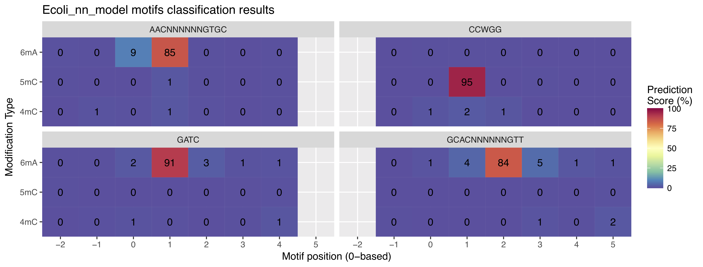

==================
Overview
==================

``nanodisco`` is a toolbox for *de novo* discovery of all the three types (6mA, 5mC and 4mC) of DNA methylation from individual bacteria and microbiomes using nanopore sequencing. For microbiomes, nanodisco also supports the use of DNA methylation patterns as natural epigenetic barcodes to facilitate high resolution metagenomic binning. Specifically, nanodisco can be used to:

* *De novo* discover DNA methylation motifs, identify specific type (6mA, 5mC or 4mC, namely *typing*) of a methylation motif, and identify which specific position within the motif is methylated (namely *fine mapping*). 
* Perform metagenomic binning based on microbial DNA methylation pattern by constructing and clustering a methylation profile matrix. 
* Integrate the two functionalities above together for *de novo* methylation motif discovery from microbiomes, and metagenomic analysis.

Authors' notes
==============

We are actively developing ``nanodisco`` to facilitate usage and broaden features. All feedback is more than welcome. You can reach us on twitter (`@iamfanggang <https://twitter.com/iamfanggang>`_ and `@AlanTourancheau <https://twitter.com/AlanTourancheau>`_) or directly through the `GitHub issues system <https://github.com/fanglab/nanodisco/issues>`_.

Installation
============

``nanodisco`` is distributed as a fully functional image bypassing the need to install any dependencies others than the virtualization software. We currently recommend using Singularity (v3.2.1 and above), which can be installed on Linux systems and is often the preferred solution by HPC administrators (`Quick Start <https://sylabs.io/guides/3.5/user-guide/quick_start.html>`_). ``nanodisco`` was tested extensively with Singularity v3.2.1 and v3.5.2.

.. code-block:: sh

   singularity pull --name nanodisco.sif shub://touala/smtm # Download the image from singularity-hub.org
   singularity build my_analysis nanodisco.sif # Create a container named my_analysis

.. _tool_showcase:

Tool showcase
=============

To showcase the toolbox applications and facilitate the understanding of the methods, we provide examples for the analysis of two datasets presented in our preprint. Those datasets can be download with the following commands from within a ``nanodisco`` container: ``get_data_bacteria`` and ``get_data_microbiome``.

Prepare the container for examples
----------------------------------

.. code-block:: sh

   singularity build --sandbox nd_example nanodisco.sif # Create a writable container (directory) named nd_example
   singularity run --no-home -w nd_example              # Start an interactive shell to use nanodisco, type `exit` to leave

.. note::
  The image retrieved from `Singularity Hub <https://singularity-hub.org/>`_ with ``singularity pull`` (e.g. nanodisco.sif) is already built and can be reused at will. The command ``singularity build`` create a container from the image as a writable directory called a ``sandbox`` (nd_example). The command ``singularity run`` starts a interactive shell within ``nd_example`` container. You can directly reuse the same ``sandbox`` directory or you can create multiple ``sandbox`` directories to compartmentalize analysis of different datasets (e.g. my_analysis and my_analysis2). Containers build with those instructions are writable meaning that results from nanodisco analysis can be retrieve when the container is not running.

Methylation typing and fine mapping
-----------------------------------

**Goal:** Identify the specific type (6mA, 5mC or 4mC, namely *typing*) of a methylation motif, and identify specific position within the motif is methylated (namely *fine mapping*). Detailed method is described in the preprint.

**Inputs:**

#. Current differences file (pre-computed in the following example, can be generated with ``nanodisco difference``)
#. Reference genome file (.fasta)
#. Methylation motifs for which one wants to perform typing and fine mapping

**Outputs:** For each queried methylation motif, ``nanodisco`` identifies the methylation type and the methylated position summarized in a heatmap (``Motifs_classification_Ecoli_nn_model.pdf``). See Figure 4d in the preprint as an example.

|Output Characterize|
*1. AACNNNNNNGTGC: highest value (85) is on the 6mA row with offset +1 (relative to the first base), meaning that the second base (A) is 6mA* 
*2. CCWGG: highest value (95) is on the 5mC row with offset +1 (relative to the first base), meaning that the second base (C) is 5mC* 
*3. GATC: highest value (91) is on the 6mA row with offset +1 (relative to the first base), meaning that the second base (A) is 6mA* 
*4. GCACNNNNNNGTT: highest value (84) is on the 6mA row with offset +2 (relative to the first base), meaning that the third base (A) is 6mA*

**Example commands:**

.. code-block:: sh

   get_data_bacteria # Retrieve E. coli current differences and reference genome
   nanodisco characterize -p 4 -b Ecoli -d dataset/EC_difference.RDS -o analysis/Ecoli_motifs -m GATC,CCWGG,GCACNNNNNNGTT,AACNNNNNNGTGC -t nn -r reference/Ecoli_K12_MG1655_ATCC47076.fasta

See parameters detailed and advanced parameters in :ref:`characterize` section. In this example, the current differences file (``EC_difference.RDS``) was generated on a whole *E. coli* nanopore sequencing dataset, from the preprint, using ``nanodisco difference``. **Runtime is ~1 min with 4 threads** (~6.5GiB memory used).

Methylation binning of metagenomic contigs
------------------------------------------

**Goal:** Construction methylation profiles for metagenomic contigs, identify informative features, and perform methylation binning for high-resolution metagenomic analysis.

**Inputs:**

#. Current differences file (pre-computed in the following example)
#. Metagenomic *de novo* assembly (.fasta)
#. Metagenomic contigs coverage files (pre-computed in the following example)
#. *De novo* discovered methylation motifs (pre-computed in the following example)
#. (Optional) Annotation for metagenome contigs (e.g. species of origin) and List of contigs from Mobile Genetic Elements (MGEs)

**Outputs:** t-SNE scatter plot that demonstrates the species level clustering of metagenomic contigs as presented in Figure 5a in the preprint.

|Output Binning|

**Example commands:**

.. code-block:: sh

   get_data_microbiome # Retrieve current differences, de novo metagenome assembly, etc
   nanodisco profile -p 4 -r reference/metagenome.fasta -d dataset/metagenome_subset_difference.RDS -w dataset/metagenome_WGA.cov -n dataset/metagenome_NAT.cov -b MGM1_motif -o analysis/binning --motifs_file dataset/list_de_novo_discovered_motifs.txt
   nanodisco binning -r reference/metagenome.fasta -s dataset/methylation_profile_MGM1_motif.RDS -b MGM1_motif -o analysis/binning
   nanodisco plot_binning -r reference/metagenome.fasta -u analysis/binning/methylation_binning_MGM1_motif.RDS -b MGM1_motif -o analysis/binning -a reference/motif_binning_annotation.RDS --MGEs_file dataset/list_MGE_contigs.txt

See parameters detailed and advanced parameters in :ref:`profile`, :ref:`binning`, and :ref:`plot_binning` sections. In this example, the current differences file (``metagenome_subset_difference.RDS``) was generated on a mouse gut microbiome nanopore sequencing dataset, MGM1 from the preprint, using ``nanodisco difference``. This example corresponds to the procedure referred to as guided methylation binning where methylation motifs were already *de novo* discovered. **Runtime is ~10 min with 4 threads** and ~4 Gb of memory used. We also described the procedure for automated methylation binning (including methylation features selection) from current differences file to binning results in the :ref:`detailed tutorial <detailed-tutorial-content>`.
 
Detailed tutorial
-----------------

To help you start analyzing your own data, we prepared comprehensive tutorial covering each ``nanodisco`` features using the two datasets retrieved with ``get_data_bacteria`` and ``get_data_microbiome``. Those examples can be found :doc:`here <detailed_tutorial>`.

Citation
========

.. |Output Binning| image:: figures/Contigs_methylation_tsne_MGM1_motif.png
  :width: 600
  :align: middle
  :alt: MGM1 guided metagenomic contigs binning
